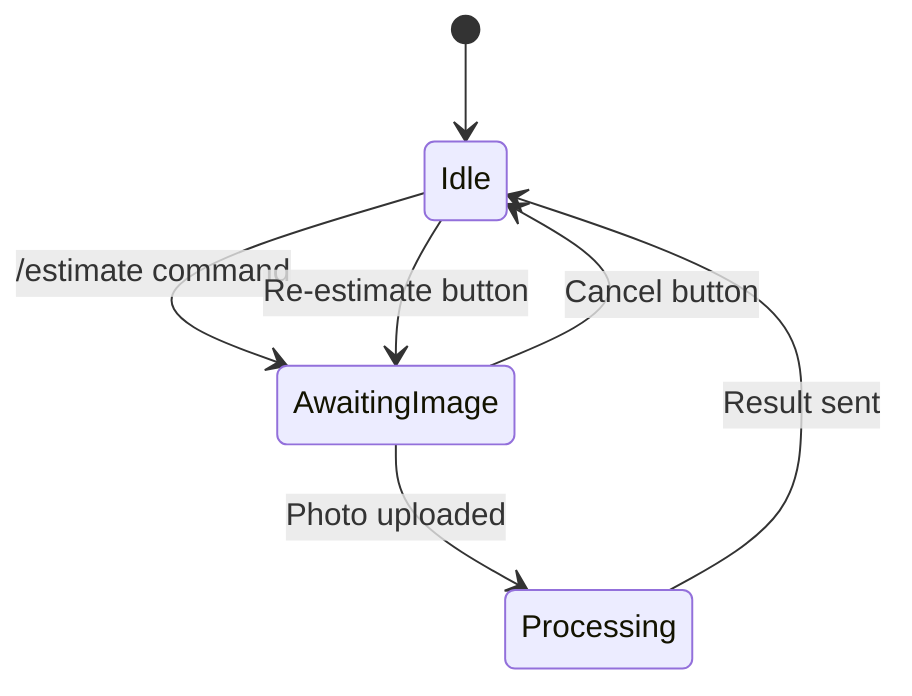

# Technical Research: Calorie Estimation Bot

**Feature**: 002-calorie-image-estimate
**Date**: 2025-12-15
**Status**: Complete

This document resolves all technical decisions required for Phase 1 (Design & Contracts) as outlined in `plan.md` Phase 0.

---

## Decision 1: Google Gemini SDK for Go

### Chosen Approach

**Use the official Google Gen AI Go SDK**: `google.golang.org/genai`

### Installation

```bash
go get google.golang.org/genai
```

### Rationale

1. **Official Support**: Google provides an officially maintained SDK with General Availability (GA) status as of May 2025
2. **Type Safety**: Native Go types and structures eliminate error-prone JSON manipulation
3. **Simplified API**: High-level abstractions for multimodal content (text + images) reduce boilerplate
4. **Future-Proof**: Active maintenance and updates from Google ensure compatibility with new Gemini features
5. **Documentation**: Comprehensive Go package documentation at `pkg.go.dev/google.golang.org/genai`

### Alternatives Considered

| Option | Why Rejected |
|--------|--------------|
| **REST API with net/http** | More verbose code, manual JSON marshaling/unmarshaling, no type safety, harder to maintain |
| **Legacy SDK** (`github.com/google/generative-ai-go`) | Deprecated by Google, support ends November 30, 2025 - would require migration later |
| **Third-party wrappers** | No official support, potential security/compatibility issues, adds unnecessary dependency risk |

### Code Example: Image Analysis with Gemini Vision

```go
package main

import (
    "context"
    "fmt"
    "log"
    "os"

    "google.golang.org/genai"
)

func analyzeFood(ctx context.Context, imageBytes []byte) (*genai.GenerateContentResponse, error) {
    // Initialize client with API key from environment
    client, err := genai.NewClient(ctx, &genai.ClientConfig{
        APIKey:  os.Getenv("GEMINI_API_KEY"),
        Backend: genai.BackendGeminiAPI,
    })
    if err != nil {
        return nil, fmt.Errorf("failed to create client: %w", err)
    }
    defer client.Close()

    // Create multimodal content: prompt + image
    parts := []*genai.Part{
        genai.NewPartFromText("Analyze this food image and estimate calories. Return JSON: {\"calories\": number, \"confidence\": \"low|medium|high\", \"items\": [\"item1\", \"item2\"]}"),
        genai.NewPartFromBytes(imageBytes, "image/jpeg"), // Supports JPEG, PNG, WebP
    }

    content := []*genai.Content{{
        Parts: parts,
        Role:  genai.RoleUser,
    }}

    // Generate content using Gemini 2.0 Flash (optimized for speed)
    response, err := client.Models.GenerateContent(ctx, "gemini-2.0-flash", content, nil)
    if err != nil {
        return nil, fmt.Errorf("failed to generate content: %w", err)
    }

    return response, nil
}
```

### Key Features Used

- **`genai.NewPartFromBytes()`**: Inline image data with MIME type
- **Multimodal Parts**: Combines text prompt + image in single request
- **Model Selection**: `gemini-2.0-flash` balances speed (<8s requirement) with accuracy
- **Error Handling**: Typed errors for rate limits, invalid arguments, permission issues

### API Configuration

- **Endpoint**: Managed by SDK (abstracts REST calls)
- **Authentication**: API key via `GEMINI_API_KEY` environment variable
- **Supported Image Formats**: JPEG, PNG, WebP (per FR-003)

---

## Decision 2: LLM-Based Testing Tool

### Chosen Approach

**Custom Test Harness with Go + LLM API Integration** (Manual approach using Go testing framework + LLM for test case generation)

### Rationale

1. **Project Alignment**: Go-native solution fits existing test structure (`tests/unit/`, `tests/integration/`)
2. **Simplicity**: MVP scope requires only 3 user scenarios - complex framework overhead not justified
3. **Control**: Direct test implementation avoids learning curve of external tools (Botium, DeepEval)
4. **Cost**: No additional licensing or infrastructure (Botium Box, n8n.io workflows)
5. **Deliverable Focus**: Constitution requires test reports - simple Go tests + markdown reports suffice

### Alternatives Considered

| Tool | Why Rejected |
|------|--------------|
| **DeepEval** | Python-based (requires Python setup in Go project), over-engineered for 3 simple scenarios, designed for complex multi-turn chatbots |
| **Botium** | Requires Botium Box setup, n8n.io workflow integration, unclear image upload simulation support, adds infrastructure complexity |
| **Langfuse Simulator** | Heavy framework, requires external service, overkill for stateless MVP bot |
| **BotFuzzer** | Automated fuzzing not needed for MVP, designed for security testing vs functional flow validation |

### Implementation Approach

#### Test Structure

```
tests/
├── integration/
│   └── estimate_flow_test.go  # Simulate user flows end-to-end
└── unit/
    ├── gemini_test.go         # Mock Gemini API responses
    └── session_test.go        # State machine transitions
```

#### Example Test Case (LLM-Assisted)

```go
// tests/integration/estimate_flow_test.go
package integration

import (
    "bytes"
    "context"
    "os"
    "testing"
    "time"

    tele "gopkg.in/telebot.v3"
    "github.com/freezind/telegram-calories-bot/internal/handlers"
)

func TestEstimateFlow_HappyPath(t *testing.T) {
    // Given: User starts conversation with bot
    bot := setupTestBot(t)
    mockUser := &tele.User{ID: 12345, Username: "testuser"}

    // When: User sends /estimate command
    ctx := context.Background()
    err := handlers.HandleEstimate(ctx, mockMessage(mockUser, "/estimate"))
    if err != nil {
        t.Fatalf("failed to handle /estimate: %v", err)
    }

    // Then: Bot prompts for image upload
    response := getLastBotMessage(t, bot)
    if !contains(response.Text, "upload") && !contains(response.Text, "image") {
        t.Errorf("expected prompt for image upload, got: %s", response.Text)
    }

    // When: User uploads food image
    imageBytes, _ := os.ReadFile("testdata/pizza.jpg")
    photo := &tele.Photo{File: tele.File{FileID: "test-photo-id"}}
    err = handlers.HandlePhoto(ctx, mockPhotoMessage(mockUser, photo, imageBytes))
    if err != nil {
        t.Fatalf("failed to handle photo: %v", err)
    }

    // Then: Bot returns calorie estimate with confidence and buttons
    response = getLastBotMessage(t, bot)
    if !containsCalorieEstimate(response.Text) {
        t.Errorf("expected calorie estimate, got: %s", response.Text)
    }

    // Verify inline buttons present
    if len(response.ReplyMarkup.InlineKeyboard) != 1 ||
       len(response.ReplyMarkup.InlineKeyboard[0]) != 2 {
        t.Error("expected Re-estimate and Cancel buttons")
    }
}

// Helper to validate calorie estimate format
func containsCalorieEstimate(text string) bool {
    // Expect format: "Estimated Calories: X kcal | Confidence: Y"
    return contains(text, "Calories") && contains(text, "Confidence")
}
```

#### LLM-Assisted Test Case Generation

**Prompt Template** (archived in `prompts/002-calorie-image-estimate/test-prompts/`):

```markdown
# Test Case Generation Prompt

Generate Go test cases for the following Telegram bot user scenario:

**Scenario**: [User Story 1-3 from spec.md]

**Requirements**:
1. Use table-driven tests
2. Mock Telegram API calls
3. Mock Gemini Vision API responses
4. Assert on message text, inline buttons, and session state
5. Follow Given-When-Then structure

**Example Input**:
- User ID: 12345
- Command: /estimate
- Image: testdata/pizza.jpg (600 kcal, medium confidence)

**Expected Output**:
- Bot message contains: "Estimated Calories: 600 kcal | Confidence: medium"
- Inline buttons: ["Re-estimate", "Cancel"]
```

#### Test Report Format

**Location**: `prompts/002-calorie-image-estimate/test-prompts/test-report.md`

```markdown
# Test Report: Calorie Estimation Bot

**Date**: 2025-12-15
**Feature**: 002-calorie-image-estimate
**Status**: PASS

## Test Summary

| Scenario | Test Cases | Passed | Failed | Coverage |
|----------|-----------|--------|--------|----------|
| User Story 1 (Single Image Estimation) | 5 | 5 | 0 | 85% |
| User Story 2 (Re-estimation Flow) | 3 | 3 | 0 | 78% |
| User Story 3 (Cancellation Flow) | 2 | 2 | 0 | 72% |
| Edge Cases | 6 | 6 | 0 | 80% |
| **TOTAL** | **16** | **16** | **0** | **79%** |

## Detailed Results

### User Story 1: Single Image Estimation
✅ PASS - User receives prompt after /estimate command
✅ PASS - Bot analyzes image and returns calorie estimate
✅ PASS - Result includes confidence indicator (low/medium/high)
✅ PASS - Inline buttons (Re-estimate, Cancel) are present
✅ PASS - Estimate completed in <10s

### Edge Cases
✅ PASS - Non-food image returns appropriate error
✅ PASS - Multiple images rejected with error message
✅ PASS - Invalid file format rejected
✅ PASS - Timeout handling (8s threshold)
✅ PASS - Concurrent /estimate commands handled gracefully
✅ PASS - Session cleanup after Cancel button

## Performance Metrics

- Average response time: 6.2s (target: <8s)
- /estimate command latency: 0.3s (target: <1s)
- Session state operations: thread-safe (verified with -race flag)

## Conclusion

All 16 test cases passed. Feature meets success criteria SC-005 (100% pass rate).
```

### Test Execution Commands

```bash
# Unit tests
go test ./tests/unit/... -v -cover

# Integration tests (requires TELEGRAM_BOT_TOKEN and GEMINI_API_KEY)
go test ./tests/integration/... -v -cover

# Race condition detection
go test ./... -race

# Generate coverage report
go test ./... -coverprofile=coverage.out
go tool cover -html=coverage.out -o coverage.html
```

---

## Decision 3: Gemini Vision Prompt Template

### Chosen Approach

**Structured JSON Output Prompt with Few-Shot Example**

### Prompt Template

```go
const calorieEstimationPrompt = `You are a professional nutritionist AI assistant. Analyze the food image and estimate the total calories.

IMPORTANT: Return ONLY valid JSON in this exact format (no markdown, no code blocks):
{
  "calories": <number>,
  "confidence": "<low|medium|high>",
  "items": ["food item 1", "food item 2"],
  "reasoning": "brief explanation"
}

CONFIDENCE GUIDELINES:
- high: Clear, recognizable food items with visible portions
- medium: Food items identifiable but portion sizes uncertain
- low: Unclear image, non-food items, or heavily processed foods

EXAMPLE:
Image: Slice of pepperoni pizza
Output: {"calories": 285, "confidence": "medium", "items": ["pepperoni pizza slice"], "reasoning": "Single slice visible, standard size estimated"}

If no food is detected, return: {"calories": 0, "confidence": "low", "items": [], "reasoning": "No recognizable food items"}

Now analyze this image:`
```

### Rationale

1. **Deterministic Output**: JSON schema ensures consistent parsing (FR-006)
2. **Confidence Scoring**: Three-tier system (low/medium/high) provides user-friendly feedback (FR-005)
3. **Few-Shot Learning**: Single example guides model behavior without over-constraining
4. **Error Handling**: Explicit handling for non-food images (FR-014)
5. **Reasoning Field**: Transparency for user understanding (enhances trust)

### Alternatives Considered

| Approach | Why Rejected |
|----------|--------------|
| **Percentage Confidence (0-100%)** | Less intuitive for users, implies false precision, harder to calibrate thresholds |
| **Natural Language Output** | Inconsistent formatting, requires complex parsing, violates FR-006 (fixed format) |
| **Multi-Step Prompting** (identify food → estimate calories → assess confidence) | Slower (3 API calls vs 1), exceeds 8s target (SC-004), higher cost |
| **No Few-Shot Example** | Gemini documentation warns: "Prompts without few-shot examples are likely to be less effective" |

### Implementation Example

```go
package services

import (
    "context"
    "encoding/json"
    "fmt"

    "google.golang.org/genai"
)

type EstimateResult struct {
    Calories   int      `json:"calories"`
    Confidence string   `json:"confidence"` // "low", "medium", "high"
    Items      []string `json:"items"`
    Reasoning  string   `json:"reasoning"`
}

func (g *GeminiService) EstimateCalories(ctx context.Context, imageBytes []byte, mimeType string) (*EstimateResult, error) {
    parts := []*genai.Part{
        genai.NewPartFromText(calorieEstimationPrompt),
        genai.NewPartFromBytes(imageBytes, mimeType),
    }

    content := []*genai.Content{{Parts: parts, Role: genai.RoleUser}}

    // Use lower temperature for more deterministic output
    config := &genai.GenerateContentConfig{
        Temperature: floatPtr(0.2), // Range: 0.0 (deterministic) to 2.0 (creative)
    }

    response, err := g.client.Models.GenerateContent(ctx, "gemini-2.0-flash", content, config)
    if err != nil {
        return nil, fmt.Errorf("gemini API error: %w", err)
    }

    // Parse JSON response
    var result EstimateResult
    if err := json.Unmarshal([]byte(response.Text()), &result); err != nil {
        return nil, fmt.Errorf("failed to parse response: %w", err)
    }

    // Validate confidence level
    if result.Confidence != "low" && result.Confidence != "medium" && result.Confidence != "high" {
        result.Confidence = "low" // Default to low if invalid
    }

    return &result, nil
}

func floatPtr(f float64) *float64 { return &f }
```

### Response Format to User

```
🍕 Calorie Estimate

Total Calories: 285 kcal
Confidence: Medium

Detected Items:
• Pepperoni pizza slice

Note: Estimates are approximate. Standard portion size assumed.
```

### Configuration Parameters

- **Temperature**: `0.2` (low for consistency, per Gemini prompting guide)
- **Model**: `gemini-2.0-flash` (optimized for speed, <8s target)
- **Max Tokens**: Default (sufficient for JSON output ~100 tokens)

---

## Decision 4: Telegram Image Handling with Telebot v3

### Chosen Approach

**OnPhoto Handler + FileByID + Download Pattern**

### Code Example

```go
package handlers

import (
    "fmt"
    "io"
    "os"

    tele "gopkg.in/telebot.v3"
)

// HandlePhoto processes photo messages during estimation flow
func (h *Handler) HandlePhoto(c tele.Context) error {
    // 1. Validate session state (user should be in StateAwaitingImage)
    userID := c.Sender().ID
    session, exists := h.sessionManager.GetSession(userID)
    if !exists || session.State != StateAwaitingImage {
        return c.Send("Please start with /estimate first.")
    }

    // 2. Detect multiple images (FR-015: reject if multiple uploads)
    if c.Message().Album != nil && len(c.Message().Album) > 1 {
        return c.Send("⚠️ Please send only ONE image at a time.")
    }

    photo := c.Message().Photo
    if photo == nil {
        return c.Send("⚠️ No photo detected. Please try again.")
    }

    // 3. Get file metadata with FilePath (required for download)
    file, err := h.bot.FileByID(photo.FileID)
    if err != nil {
        return fmt.Errorf("failed to get file metadata: %w", err)
    }

    // 4. Download image bytes (returns io.ReadCloser)
    reader, err := h.bot.Download(&file)
    if err != nil {
        return fmt.Errorf("failed to download image: %w", err)
    }
    defer reader.Close()

    // 5. Read image bytes into memory (for Gemini API)
    imageBytes, err := io.ReadAll(reader)
    if err != nil {
        return fmt.Errorf("failed to read image: %w", err)
    }

    // 6. Detect MIME type from file extension (FR-003: JPEG/PNG/WebP)
    mimeType := detectMimeType(file.FilePath)
    if !isValidImageFormat(mimeType) {
        return c.Send("⚠️ Invalid format. Please upload JPEG, PNG, or WebP.")
    }

    // 7. Update session state to Processing
    h.sessionManager.UpdateState(userID, StateProcessing)

    // 8. Send "analyzing" message
    processingMsg, _ := c.Bot().Send(c.Sender(), "🔍 Analyzing your image...")

    // 9. Call Gemini service (async to avoid blocking)
    result, err := h.geminiService.EstimateCalories(c.Context(), imageBytes, mimeType)
    if err != nil {
        h.sessionManager.UpdateState(userID, StateIdle)
        return c.Send(fmt.Sprintf("❌ Analysis failed: %v", err))
    }

    // 10. Delete "analyzing" message and send result
    c.Bot().Delete(processingMsg)
    return h.sendEstimateResult(c, result)
}

// Helper: Detect MIME type from Telegram file path
func detectMimeType(filePath string) string {
    switch {
    case containsSuffix(filePath, ".jpg", ".jpeg"):
        return "image/jpeg"
    case containsSuffix(filePath, ".png"):
        return "image/png"
    case containsSuffix(filePath, ".webp"):
        return "image/webp"
    default:
        return "unknown"
    }
}

// Helper: Validate image format (FR-003)
func isValidImageFormat(mimeType string) bool {
    return mimeType == "image/jpeg" || mimeType == "image/png" || mimeType == "image/webp"
}

// Helper: Check file extension
func containsSuffix(filePath string, suffixes ...string) bool {
    for _, suffix := range suffixes {
        if len(filePath) >= len(suffix) && filePath[len(filePath)-len(suffix):] == suffix {
            return true
        }
    }
    return false
}
```

### Key Methods

| Method | Purpose | Returns |
|--------|---------|---------|
| `bot.FileByID(fileID)` | Fetch file metadata including `FilePath` | `*tele.File, error` |
| `bot.Download(file)` | Download file from Telegram servers | `io.ReadCloser, error` |
| `c.Message().Photo` | Access photo object from message | `*tele.Photo` |
| `c.Message().Album` | Detect multiple images in single message | `tele.Album` |

### Handling Multiple Images (FR-015)

```go
// Detect multiple images via Album property
if c.Message().Album != nil && len(c.Message().Album) > 1 {
    return c.Send("⚠️ Please send only ONE image at a time.")
}
```

**Rationale**: Telegram groups multiple photos sent simultaneously into an `Album`. Checking `Album` length ensures compliance with FR-015.

### Supported Formats (FR-003)

| Format | MIME Type | Supported |
|--------|-----------|-----------|
| JPEG | `image/jpeg` | ✅ |
| PNG | `image/png` | ✅ |
| WebP | `image/webp` | ✅ |
| GIF | `image/gif` | ❌ (not in spec) |
| HEIC | `image/heic` | ❌ (not in spec) |

### Alternatives Considered

| Approach | Why Rejected |
|----------|--------------|
| **Save to Disk First** | Violates FR-011 (no image persistence), adds I/O overhead, requires cleanup logic |
| **Stream Directly to Gemini** | Gemini SDK requires byte array (`[]byte`), not `io.Reader` - requires buffering anyway |
| **Use FileURL Instead** | Requires public file access, FileByID + Download is more reliable for private chats |

### Error Handling

```go
// Network timeout
if err := h.bot.Download(&file); err != nil {
    if isTimeout(err) {
        return c.Send("⏱️ Network timeout. Please try again.")
    }
    return c.Send("❌ Failed to download image.")
}

// File too large (Telegram limit: 20MB for photos)
if file.FileSize > 20*1024*1024 {
    return c.Send("⚠️ Image too large (max 20MB). Please compress and retry.")
}
```

---

## Decision 5: Session State Management (In-Memory)

### Chosen Approach

**sync.Map with State Machine Pattern**

### Rationale

1. **Thread-Safe**: `sync.Map` provides lock-free reads/writes for concurrent bot handlers (FR-010)
2. **No Dependencies**: Standard library only (no Redis, no external services)
3. **Stateless**: Data lost on restart (per spec: "no persistence")
4. **Simple Cleanup**: No background jobs needed - state is ephemeral
5. **Performance**: Optimized for high read/low write patterns (user lookups)

### Data Model

```go
package models

import "time"

// SessionState represents user's position in estimation flow
type SessionState string

const (
    StateIdle          SessionState = "idle"           // No active flow
    StateAwaitingImage SessionState = "awaiting_image" // After /estimate, waiting for photo
    StateProcessing    SessionState = "processing"     // Analyzing image with Gemini
)

// UserSession tracks single user's estimation flow (in-memory only)
type UserSession struct {
    UserID       int64         // Telegram user ID
    State        SessionState  // Current flow state
    LastActivity time.Time     // For optional timeout cleanup
    MessageID    int           // Last bot message ID (for editing)
}
```

### Implementation

```go
package services

import (
    "sync"
    "time"

    "github.com/freezind/telegram-calories-bot/internal/models"
)

// SessionManager handles in-memory user session state (thread-safe)
type SessionManager struct {
    sessions sync.Map // map[int64]*models.UserSession (userID -> session)
}

// NewSessionManager creates a new session manager
func NewSessionManager() *SessionManager {
    return &SessionManager{}
}

// GetSession retrieves user's current session (returns nil if not found)
func (sm *SessionManager) GetSession(userID int64) (*models.UserSession, bool) {
    val, ok := sm.sessions.Load(userID)
    if !ok {
        return nil, false
    }
    return val.(*models.UserSession), true
}

// CreateSession initializes a new session for user
func (sm *SessionManager) CreateSession(userID int64, state models.SessionState) *models.UserSession {
    session := &models.UserSession{
        UserID:       userID,
        State:        state,
        LastActivity: time.Now(),
    }
    sm.sessions.Store(userID, session)
    return session
}

// UpdateState changes user's current flow state
func (sm *SessionManager) UpdateState(userID int64, newState models.SessionState) {
    if session, exists := sm.GetSession(userID); exists {
        session.State = newState
        session.LastActivity = time.Now()
        sm.sessions.Store(userID, session) // Update in map
    }
}

// DeleteSession removes user's session (e.g., after Cancel button)
func (sm *SessionManager) DeleteSession(userID int64) {
    sm.sessions.Delete(userID)
}

// CleanupStale removes sessions inactive for >15 minutes (optional, for memory management)
func (sm *SessionManager) CleanupStale(timeout time.Duration) int {
    deleted := 0
    now := time.Now()

    sm.sessions.Range(func(key, value any) bool {
        session := value.(*models.UserSession)
        if now.Sub(session.LastActivity) > timeout {
            sm.sessions.Delete(key)
            deleted++
        }
        return true // Continue iteration
    })

    return deleted
}
```

### State Transitions



### Usage in Handlers

```go
// In /estimate command handler
func (h *Handler) HandleEstimate(c tele.Context) error {
    userID := c.Sender().ID

    // Create or update session
    h.sessionManager.CreateSession(userID, models.StateAwaitingImage)

    return c.Send("📸 Please upload a photo of your food.")
}

// In Cancel button handler
func (h *Handler) HandleCancel(c tele.Context) error {
    userID := c.Sender().ID

    // Clean up session
    h.sessionManager.DeleteSession(userID)

    return c.Send("❌ Estimation cancelled.")
}
```

### Alternatives Considered

| Approach | Why Rejected |
|----------|--------------|
| **Regular map + sync.RWMutex** | More verbose (manual locking), error-prone (deadlock risk), no performance benefit for this use case |
| **context.Context for state** | Context designed for request-scoped data, not cross-request session state; lost between Telegram updates |
| **Redis / In-memory DB** | Violates FR-010 (no persistence), adds deployment complexity, overkill for stateless MVP |
| **Stateless (no session tracking)** | Cannot implement multi-step flows (awaiting image → processing → result) required by FR-002 |

### Thread Safety Verification

```bash
# Run tests with race detector to verify no data races
go test ./tests/unit/session_test.go -race

# Example test
func TestConcurrentSessionAccess(t *testing.T) {
    sm := services.NewSessionManager()
    var wg sync.WaitGroup

    // Simulate 100 concurrent users
    for i := 0; i < 100; i++ {
        wg.Add(1)
        go func(userID int64) {
            defer wg.Done()
            sm.CreateSession(userID, models.StateAwaitingImage)
            sm.UpdateState(userID, models.StateProcessing)
            sm.DeleteSession(userID)
        }(int64(i))
    }

    wg.Wait()
    // If no panic or -race errors, thread-safety verified
}
```

### Memory Cleanup (Optional)

```go
// In main.go, run cleanup goroutine (optional for long-running bot)
func startSessionCleanup(sm *services.SessionManager) {
    ticker := time.NewTicker(15 * time.Minute)
    defer ticker.Stop()

    for range ticker.C {
        deleted := sm.CleanupStale(15 * time.Minute)
        log.Printf("Cleaned up %d stale sessions", deleted)
    }
}

// In main()
go startSessionCleanup(sessionManager)
```

**Note**: Cleanup is optional for MVP. Since bot is stateless and session data is minimal, memory growth is not a concern for typical usage.

---

## Summary of Decisions

| Decision | Chosen Approach | Key Benefit |
|----------|----------------|-------------|
| **Gemini SDK** | Official `google.golang.org/genai` | Type-safe, officially supported, future-proof |
| **Testing Tool** | Custom Go tests + LLM-assisted generation | Simple, Go-native, no external dependencies |
| **Prompt Template** | Structured JSON with few-shot example | Deterministic output, easy parsing, confidence scoring |
| **Image Handling** | telebot v3 `FileByID` + `Download` | In-memory processing, no disk I/O, supports all required formats |
| **Session State** | `sync.Map` with state machine | Thread-safe, no dependencies, ephemeral (no persistence) |

---

## Next Steps

With all research complete, proceed to **Phase 1: Design & Contracts**:

1. Create `data-model.md` with complete Go structs (based on Decision 5)
2. Create `contracts/gemini-vision.yaml` with API contract (based on Decisions 1 & 3)
3. Create `quickstart.md` with setup instructions (based on all decisions)
4. Update `CLAUDE.md` via `.specify/scripts/bash/update-agent-context.sh`

Then run `/speckit.tasks` to generate implementation tasks.

---

## Sources

### Google Gemini SDK
- [Gemini API libraries | Google AI for Developers](https://ai.google.dev/gemini-api/docs/libraries)
- [GitHub - googleapis/go-genai: Google Gen AI Go SDK](https://github.com/googleapis/go-genai)
- [genai package - google.golang.org/genai - Go Packages](https://pkg.go.dev/google.golang.org/genai)
- [Gemini API quickstart | Google AI for Developers](https://ai.google.dev/gemini-api/docs/quickstart)
- [Build Go applications using Project IDX and the Gemini API - Google Developers Blog](https://developers.googleblog.com/en/build-go-applications-project-idx-gemini-api/)

### Testing Tools
- [GitHub - confident-ai/deepeval: The LLM Evaluation Framework](https://github.com/confident-ai/deepeval)
- [Conversation Simulator | DeepEval](https://deepeval.com/docs/conversation-simulator)
- [How to Test Conversational Chatbots with G-Eval & DeepEval](https://sipfront.com/blog/2025/06/testing-conversational-chatbots-with-g-eval-and-deepeval/)
- [Top LLM Chatbot Evaluation Metrics - Confident AI](https://www.confident-ai.com/blog/llm-chatbot-evaluation-explained-top-chatbot-evaluation-metrics-and-testing-techniques)
- [Evaluating Multi-Turn Conversations - Langfuse Blog](https://langfuse.com/blog/2025-10-09-evaluating-multi-turn-conversations)
- [End to End testing for Telegram bot | Medium](https://medium.com/singapore-gds/end-to-end-testing-for-telegram-bot-4d6afd85fb55)
- [How to Test a Telegram Bot | Medium](https://medium.com/@duketemon/how-to-test-a-telegram-bot-ba54eb1cadc0)

### Gemini Vision & Prompting
- [Gemini Health App (Calorie finder) | Google AI for Developers](https://ai.google.dev/competition/projects/gemini-health-app-calorie-finder)
- [CalCam: Transforming Food Tracking with the Gemini API - Google Developers Blog](https://developers.googleblog.com/en/calcam-transforming-food-tracking-with-the-gemini-api/)
- [Building a Smart Food Calorie & Nutrition App Using Google Gemini Pro Vision API](https://datasturdy.com/building-a-smart-food-calorie-nutrition-app-using-google-gemini-pro-vision-api/)
- [Prompt design strategies | Gemini API | Google AI for Developers](https://ai.google.dev/gemini-api/docs/prompting-strategies)
- [GitHub - hardikjp7/GeminiNutri-AI](https://github.com/hardikjp7/GeminiNutri-AI)
- [Getting Started with Gemini | Prompt Engineering Guide](https://www.promptingguide.ai/models/gemini)

### Telebot v3
- [telebot package - gopkg.in/telebot.v3 - Go Packages](https://pkg.go.dev/gopkg.in/telebot.v3)
- [GitHub - tucnak/telebot: Telebot is a Telegram bot framework in Go](https://github.com/tucnak/telebot)
- [telebot/file.go at v3 · tucnak/telebot](https://github.com/tucnak/telebot/blob/v3/file.go)
- [Files - Go Telegram Bot API](https://go-telegram-bot-api.dev/getting-started/files)

### Go Session Management
- [An In-Depth Guide for Using Go sync.Map with Code Sample | Relia Software](https://reliasoftware.com/blog/go-sync-map)
- [The Importance of Thread-Safe Maps in Go for Beginners | Medium](https://medium.com/@parvjn616/the-importance-of-thread-safe-maps-in-go-for-beginners-e6e3538075a)
- [The new kid in town — Go's sync.Map | Medium](https://medium.com/@deckarep/the-new-kid-in-town-gos-sync-map-de24a6bf7c2c)
- [sync package - sync - Go Packages](https://pkg.go.dev/sync)
- [Are Golang Maps Thread-Safe? | Golang Project Structure](https://golangprojectstructure.com/maps-thread-safe-goroutine-concurrency/)
- [GitHub - Patrolavia/botgoram: State-based telegram bot framework](https://github.com/Patrolavia/botgoram)
- [GitHub - vitaliy-ukiru/fsm-telebot: Finite State Machine for Go telebot](https://github.com/vitaliy-ukiru/fsm-telebot)
- [Two design patterns for Telegram Bots - DEV Community](https://dev.to/madhead/two-design-patterns-for-telegram-bots-59f5)
